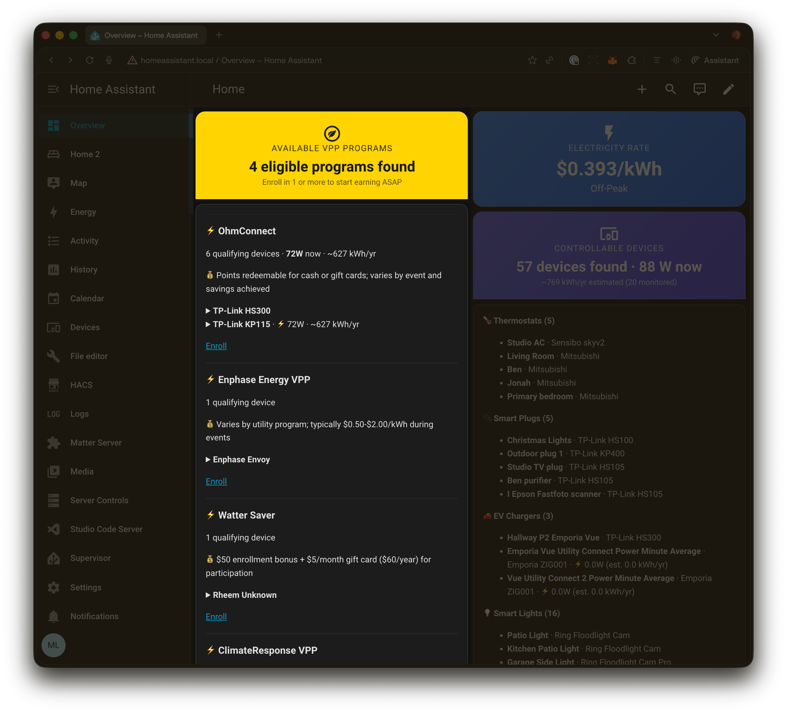

# Communal Grid technical preview for Home Assistant

[](https://github.com/hacs/integration)
[](https://github.com/Civilian-Power/communal-grid-ha/releases)

[](https://my.home-assistant.io/redirect/hacs_repository/?owner=Civilian-Power&repository=communal-grid-ha&category=integration)

Communal Grid is a smart home service that automatically finds your smart energy devices (e.g. Nest thermostats, EV chargers, batteries, smart plugs, heat pump water heaters, etc.) and matches them to Virtual Power Plant (VPP) programs in your area that will pay you to use them more efficiently. It looks at your utility company, your location, and the specific devices you own to show you exactly which programs you're eligible for and how to enroll. Think of it as a matchmaker between your smart home and the clean energy programs that turn everyday devices into grid-supporting assets — earning you money while  preventing blackouts and reducing emissions. Try [Communal Grid on Home Assistant](https://my.home-assistant.io/redirect/hacs_repository/?owner=Civilian-Power&repository=communal-grid-ha&category=integration) today!

## Features

- **Suggested VPP programs** — Local programs that reward you for optimizing power usage for smart devices
- **VPP program directory** — Bundled registry of Virtual Power Plant programs with enrollment links and reward info
- **DER device mapping** — Maps your discovered devices to Distributed Energy Resource types for VPP eligibility
- **HACS compatible** — Install through the [Home Assistant](https://www.home-assistant.io/) Community Store

## Requirements

1. **Live in the United States or Canada** (for VPP program coverage)
2. **[Home Assistant](https://www.home-assistant.io/)** running within your home or business (Works on Home Assistant hardware, Raspberry Pi, or Docker containers)
3. **OpenEI API Key** (free) — Sign up at [apps.openei.org/services/api/signup](https://apps.openei.org/services/api/signup/)
4. **Know your rate plan** — Check your utility bill for the plan name (e.g., PG&E E-TOU-C)

## Installation

### HACS (Recommended)

[](https://my.home-assistant.io/redirect/hacs_repository/?owner=Civilian-Power&repository=communal-grid-ha&category=integration)

1. Open HACS in your Home Assistant
2. Click the three dots menu → **Custom repositories**
3. Add `https://github.com/Civilian-Power/communal-grid-ha` with category **Integration**
4. Search for **Communal Grid** and click **Download**
5. Restart Home Assistant

### Manual

1. Copy the `custom_components/communal_grid/` folder to your Home Assistant's `custom_components/` directory
2. Restart Home Assistant

## Setup

1. Go to **Settings → Devices & Services → Add Integration**
2. Search for **Communal Grid**
3. Follow the 3-step setup:
   - **Step 1:** Enter your OpenEI API key
   - **Step 2:** Select your utility company — the list is automatically filtered to utilities near your Home Assistant home location
   - **Step 3:** Select your rate plan

> **Note:** The utility auto-detection uses the home location configured in **Settings → System → General**. Make sure your home address is set for the best results.

## Show VPP Matches on your Home Assistant dashboard

### VPP Matches Card

After installing, go to any dashboard → Edit → Add Card → select **Communal Grid**. No additional setup needed.



## Supported Utilities

Any US utility in the [OpenEI Utility Rate Database](https://apps.openei.org/USURDB/) is supported, including:

- Pacific Gas & Electric (PG&E)
- Southern California Edison (SCE)
- San Diego Gas & Electric (SDG&E)
- Los Angeles Dept. of Water & Power (LADWP)
- Duke Energy
- Florida Power & Light
- Commonwealth Edison (ComEd)
- And 3,700+ more...

## How It Works

1. During setup, the integration uses your Home Assistant home location to find nearby utilities, then fetches your selected utility's rate schedule from OpenEI
2. Every 24 hours, it re-fetches the schedule to pick up any rate changes
3. Every 1 minute, it recalculates which TOU period is active based on:
   - Current time of day
   - Day of week (weekday vs. weekend)
   - Season (summer vs. winter)
4. Every 5 minutes, it scans your Home Assistant for controllable energy devices and reads their current power draw
5. Sensors update with the current rate, tier, and device information
6. If the API is unreachable, it continues using the last successfully fetched schedule

## Device Discovery

Communal Grid automatically discovers devices across your Home Assistant that can help reduce energy usage. It scans the entity and device registries every 5 minutes and categorizes devices into:

| Category | What it finds | How it detects them |
|----------|--------------|---------------------|
| Thermostats | Nest, Ecobee, etc. | All `climate` domain entities |
| Smart Plugs | TP-Link, Kasa, Shelly, Meross, etc. | `switch` entities with `device_class: outlet` or known manufacturers |
| EV Chargers | Wallbox, ChargePoint, OpenEVSE, etc. | Keyword matching on entity name/model |
| Water Heaters | Any smart water heater | All `water_heater` domain entities |
| Smart Lights | Any smart light | All `light` domain entities |
| Power Monitors | Energy monitoring sensors | `sensor` entities with `device_class: power` or `energy` |

For devices with power monitoring (like the TP-Link KP115), Communal Grid reads the current wattage and estimates annual energy usage based on `watts × 8,760 hours ÷ 1,000`.

## VPP & DER Registries

Communal Grid includes two bundled data registries that map your discovered devices to real-world energy programs:

### Virtual Power Plants (VPPs)

The **VPP registry** (`data/vpp_registry.json`) is a curated list of Virtual Power Plant programs across the US. Each entry includes:

| Field | Description |
|-------|-------------|
| Geographic regions | States and specific utilities the program serves |
| Enrollment URL | Where to sign up for the program |
| Management URL | Where to manage your enrollment |
| Supported devices | **Model-specific** — which manufacturer/model combos the program works with |
| Reward structure | How you get paid — per kWh, per event, flat monthly/yearly |

VPP device compatibility is at the **manufacturer + model** level, not just device category. For example, OhmConnect supports TP-Link KP115 (energy monitoring) but not KP125M. Each `supported_devices` entry specifies the DER type, manufacturer, and models with three match modes: exact match (default), prefix match (for model families like "EcoNet*"), or wildcard (`"*"` for any).

**Included VPP programs:** OhmConnect, Tesla Virtual Power Plant, Nest Renew, Enphase VPP, sonnenCommunity, Sunrun VPP, Generac Concerto, Enel X Demand Response, Virtual Peaker BYOD, Swell Energy VPP.

### Distributed Energy Resources (DERs)

The **DER registry** (`data/der_registry.json`) maps device types to your Home Assistant devices and to VPP programs. Each entry includes:

| Field | Description |
|-------|-------------|
| HA domain & category | Maps to your Controllable Devices sensor categories |
| Controllable actions | What actions can be automated (e.g., set_temperature, turn_off) |
| Energy impact | Low, medium, high, or very high |
| Typical power range | Min/max watts for the device type |
| VPP compatible | Whether VPP programs support this device type |
| Demand response role | How this device helps during grid events |

**Included DER types:** Smart Thermostat, Smart Plug, EV Charger, Smart Water Heater, Smart Light, Home Battery, Pool Pump, Solar Inverter.

### How They Connect

```
Your HA Devices              DER Type              VPP Match (model-specific)
───────────────────────   ─────────────────   ─────────────────────────────
Google Nest Thermostat ──► smart_thermostat ──► OhmConnect (Nest models ✓)
                                            ──► Nest Renew (Nest models ✓)
                                            ──► Enel X (any thermostat ✓)

TP-Link KP115          ──► smart_plug      ──► OhmConnect (KP115 ✓)
                                            ──► Enel X (any plug ✓)

TP-Link KP125M         ──► smart_plug      ──► OhmConnect (KP125M ✗)
                                            ──► Enel X (any plug ✓)

Rheem EcoNet WH        ──► smart_water_htr ──► OhmConnect (EcoNet* ✓)
Rheem Performance WH   ──► smart_water_htr ──► OhmConnect (not EcoNet ✗)

Tesla Powerwall 3      ──► battery_storage ──► Tesla VPP (Powerwall* ✓)
                                            ──► Swell Energy (Powerwall* ✓)
```

### Updating the Registries

Both registry files are standalone JSON and can be updated without changing any code:

1. Edit `custom_components/communal_grid/data/vpp_registry.json` to add/remove VPP programs
2. Edit `custom_components/communal_grid/data/der_registry.json` to add/remove DER device types
3. Restart Home Assistant to reload the updated data

## Troubleshooting

- **"Invalid API key"** — Verify your key at [apps.openei.org](https://apps.openei.org). OpenEI keys are different from NREL developer keys.
- **No rate plans found** — Your utility may not have residential TOU plans in OpenEI. Try searching the [USRDB web interface](https://apps.openei.org/USURDB/) to verify.
- **Rate shows 0.0** — The rate plan may be flat-rate or tiered rather than TOU. Check the integration logs for parsing warnings.
- **Controllable Devices shows 0** — Make sure your other integrations (Nest, TP-Link, etc.) are set up and working in Home Assistant first. Communal Grid can only discover devices that are already registered.

## Contributing

Issues and pull requests welcome at [github.com/Civilian-Power/communal-grid-ha](https://github.com/Civilian-Power/communal-grid-ha).

## License

MIT
